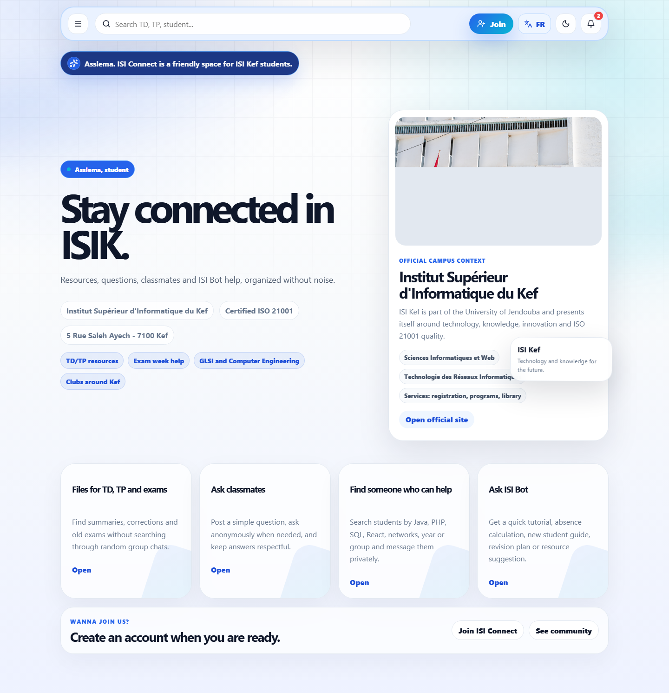
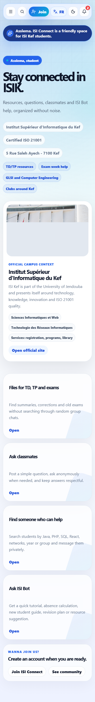
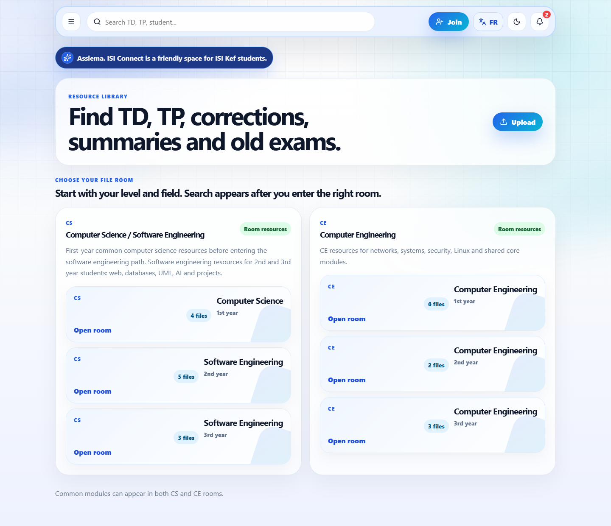
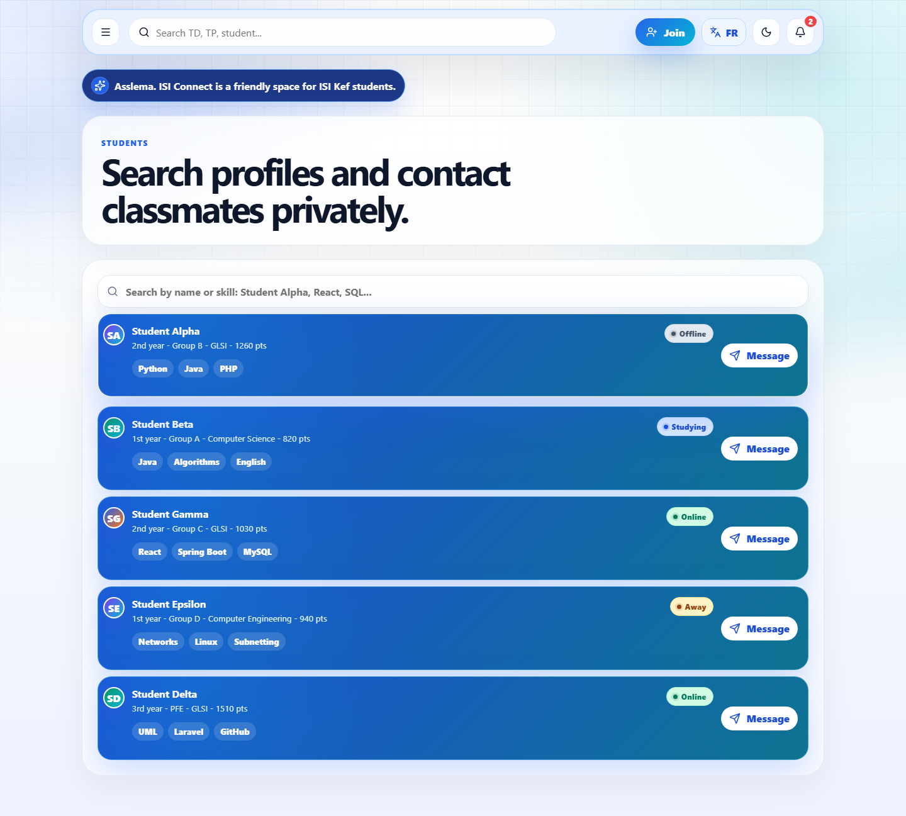

# ISI Connect

ISI Connect is a digital campus web app for ISI Kef students. It brings together student posts, private messages, resources, professor course spaces, AI help, points, notifications, and file organization by year and specialty.

## Screenshots









## Tech Stack

- React 19
- TypeScript
- Vite
- Lucide React icons

## Local Development

```bash
npm install
npm run dev
```

Open `http://localhost:5173`.

## Production Build

```bash
npm run build
npm run preview
```

The publishable static output is generated in `dist/`.

## Demo Accounts

The public demo keeps admin access disabled by default.

- Student demo: `Student Alpha` / `student123`
- Professor demo: `Professor Alpha` / `prof123`

For private local testing only, copy `.env.example` to `.env` and set:

```bash
VITE_ENABLE_DEMO_ADMIN=true
VITE_DEMO_ADMIN_PASSWORD=choose-a-private-local-password
```

Then restart the dev server. Do not enable this flag on a public deployment.

## Deploy

### Netlify

1. Connect this folder/repository to Netlify.
2. Netlify will use `netlify.toml`.
3. Build command: `npm run build`.
4. Publish directory: `dist`.

### Vercel

1. Import the project in Vercel.
2. Vercel will use `vercel.json`.
3. Framework preset: Vite.
4. Output directory: `dist`.

## Notes Before Real Student Use

This frontend is ready to publish as a static app. For real accounts, private chat, uploaded files, moderation, and AI responses in production, connect it to a backend service with authentication, database storage, file storage, and server-side moderation.
